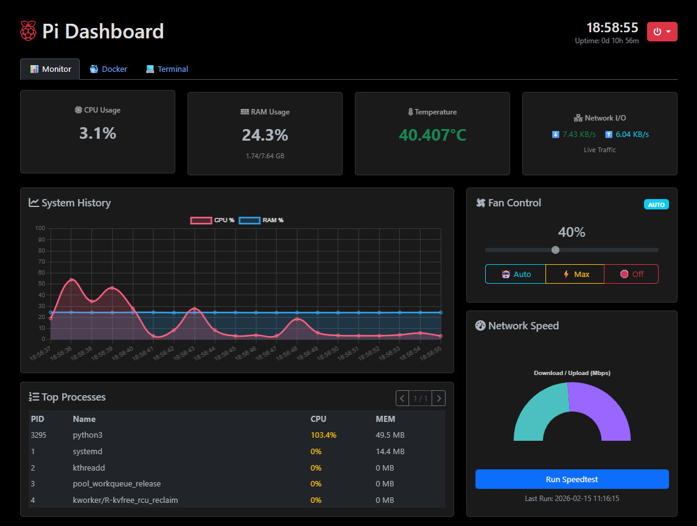

# 🍓 Raspberry Pi Dashboard


A sleek, lightweight, and comprehensive web dashboard for monitoring and managing your Raspberry Pi HomeLab.



## ✨ Features
- 📊 **Real-time Monitoring:** Live stats for CPU, RAM, Disk usage, and Core Temperature.
- 🐳 **Docker Management:** View, Start, Stop, Restart, and Remove containers directly from the UI.
- 🌪️ **Smart Fan Control:** PWM fan control via GPIO (Default Pin 18) with Auto, Max, and Off modes.
- ⚡ **Network Speedtest:** Integrated 1-click speed test to check your Pi's bandwidth.
- 🖥️ **System Terminal Log:** View real-time OS events (`journalctl`) straight from the browser.
- 🛠️ **Tech Stack:** Python (Flask) backend + Bootstrap 5 & Chart.js frontend.

---

## 🚀 Installation (Method 1: Direct on OS - Recommended)
*Running directly on the OS (Bare-metal) is highly recommended for full hardware access, accurate Fan Control, and System Log reading.*

**1. Install system dependencies:**
```bash
sudo apt update
sudo apt install -y git python3-pip python3-flask python3-psutil python3-docker python3-rpi-lgpio speedtest-cli

```

**2. Clone the repository:**

```bash
git clone [https://github.com/reikageisme/Dashboard_Pi4.git](https://github.com/reikageisme/Dashboard_Pi4.git)
cd Dashboard_Pi4

```

**3. Run the application:**

```bash
sudo python3 app.py

```

*Your dashboard is now live at `http://<your-pi-ip>:5000*`

### 💡 Make it run forever (Systemd Service)

To keep the dashboard running automatically after a reboot:

```bash
sudo nano /etc/systemd/system/pi_dashboard.service

```

Paste the following (adjust the path if needed):

```ini
[Unit]
Description=Pi Web Dashboard
After=network.target docker.service

[Service]
Type=simple
User=root
WorkingDirectory=/home/your_user/Dashboard_Pi4
ExecStart=/usr/bin/python3 /home/your_user/Dashboard_Pi4/app.py
Restart=always
RestartSec=5
Environment=PYTHONUNBUFFERED=1

[Install]
WantedBy=multi-user.target

```

Enable and start the service:

```bash
sudo systemctl daemon-reload
sudo systemctl enable pi_dashboard.service
sudo systemctl start pi_dashboard.service

```

---

## 🐳 Installation (Method 2: Docker)

*If you prefer containerized isolation (Note: Fan control and full OS logs might be limited).*

**1. Clone the repository & enter directory:**

```bash
git clone [https://github.com/reikageisme/Dashboard_Pi4.git](https://github.com/reikageisme/Dashboard_Pi4.git)
cd Dashboard_Pi4

```

**2. Build and run the container:**

```bash
docker compose up --build -d

```

*Open your browser and go to `http://<your-pi-ip>:5000`.*

---

## ⚙️ Configuration

* **Authentication:**
    *   **Default Username:** `admin`
    *   **Default Password:** `admin`
    *   **Change Credentials:** Set the `ADMIN_USER` and `ADMIN_PASS` environment variables.
    
    *Example (Systemd):*
    ```ini
    Environment=ADMIN_USER=myuser
    Environment=ADMIN_PASS=mypassword
    Environment=SECRET_KEY=yoursecretkey
    ```

    *Example (Docker):*
    Edit `docker-compose.yml`:
    ```yaml
    environment:
      - ADMIN_USER=myuser
      - ADMIN_PASS=mypassword
      - SECRET_KEY=yoursecretkey
    ```

* **GPIO Pin:** Edited in `app.py` (Default is `18`).
* **Timezone:** Ensure your Raspberry Pi has the correct timezone set so the charts display accurately:
```bash
sudo timedatectl set-timezone Asia/Ho_Chi_Minh

```


## ⚠️ Important Notes

* **Fan Control:** If you lack the `python3-rpi-lgpio` package, the fan control will run in generic "simulation mode" (no error, but no hardware action will occur).
* **Permissions:** If running without `sudo` (not recommended for hardware access), ensure your user is in the correct groups:
```bash
sudo usermod -aG gpio $USER
sudo usermod -aG docker $USER

```


## 🤝 Contributing

Feel free to fork this project, submit pull requests, or open issues to suggest new features!
